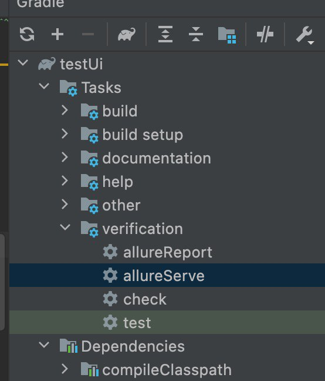
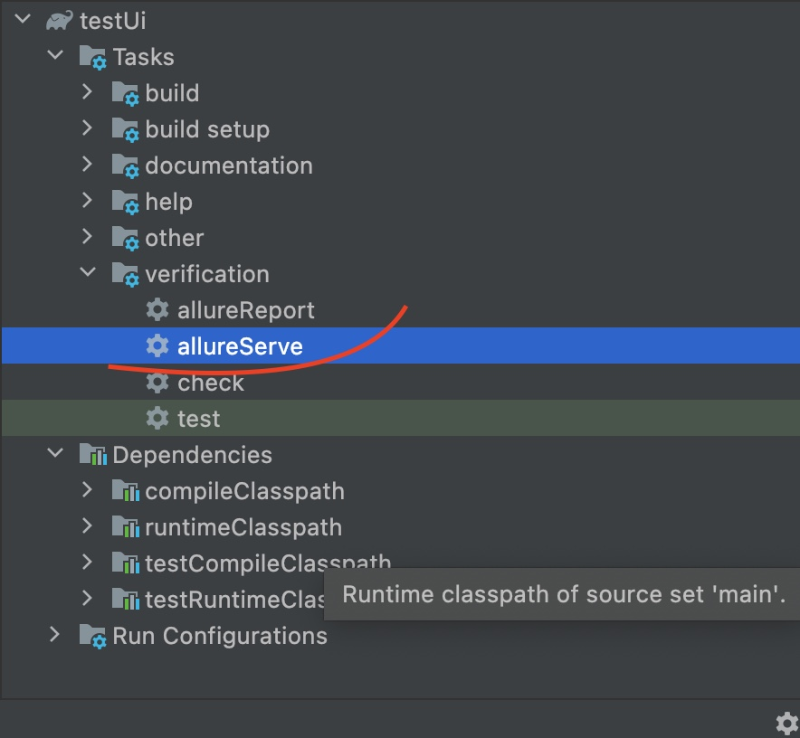
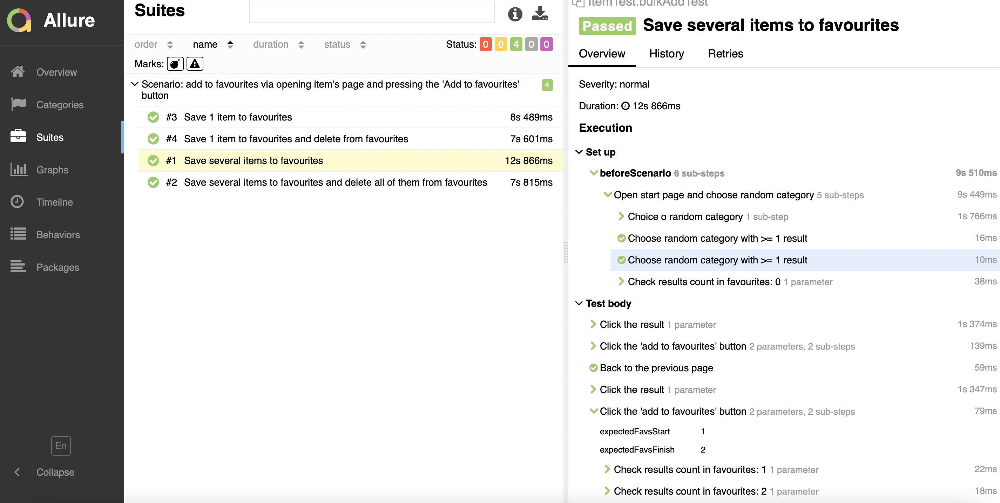
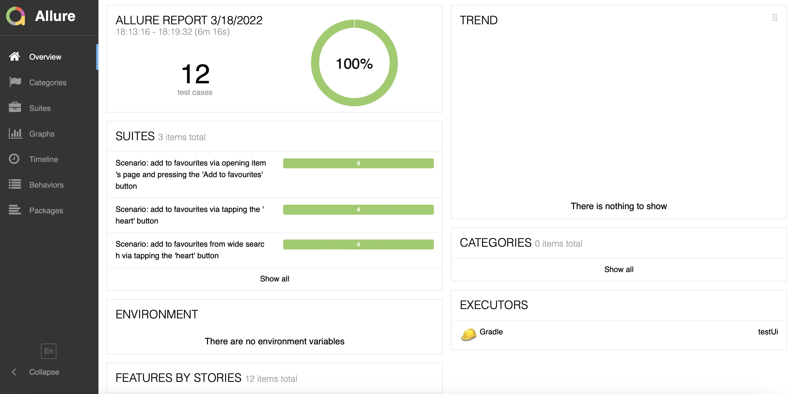
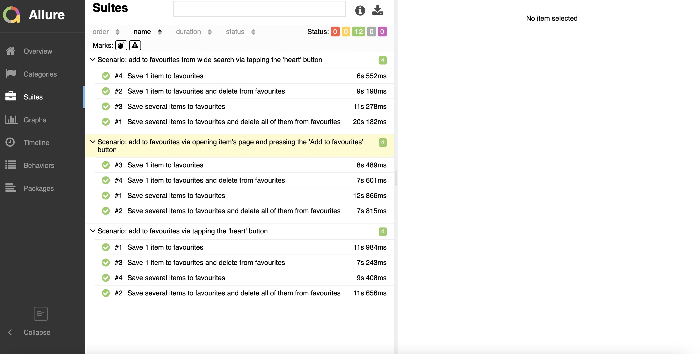
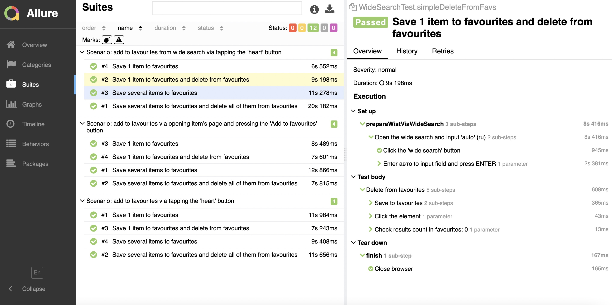

Here is the project for the test task (task.txt)

I decided to use Allure instead of Cucumber for for informative and pretty view
To run tests please clone the project and press the buttons (see the screenshot below)

I've divided the task to 3 scenarios depending on type og adding to favourites:

- via wide search
- via clicking the 'heart' button
- via clicking the 'add to favourites' button

Each scenario contains 4 cases:
- 1 simple adding
- 1 adding and deleting
- bulk adding
- bulk adding and deleting

Running a scenario:

After running a test/group of tests you can generate report (automatically). 
Run AllureServe to look through the results (screenshot below)

I used Java, Junit5, Allure, Gradle, Chromdriver for browser Chrome(99.0.4844.74)

If you do not have an opportunity to run tests and results look at the screenshots:

1 case in detail: 

All scenarios briefly:

All scenarios in detail: :

