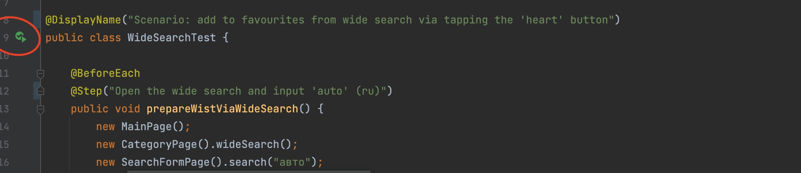

Вместо Cucumber использовала отчет аллюр для более красивого представления
Запустить тесты можно выкачав проект и нажав соответствующие кнопки запуска

Сценарии разделила на 3 группы в зависимости от типа добавления в избранное:
- в расширенном поиске
- через добавление "сердечками" при поиске предложений
- с помощью кнопки добавления внижу страницу с предложением

Каждый сценарий содержит по 4 кейса:
- одно добавление
- одно добавление и удаление
- массовое добавление
- массовое добавление и удаление

Чтобы посмотреть аллюр-отчет достаточно запустить AllureServe (см скриншот)

